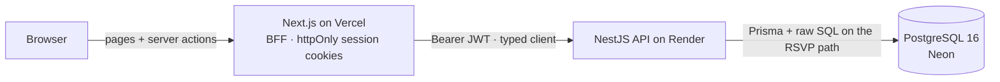
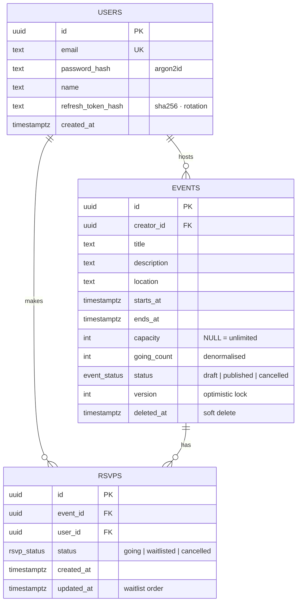
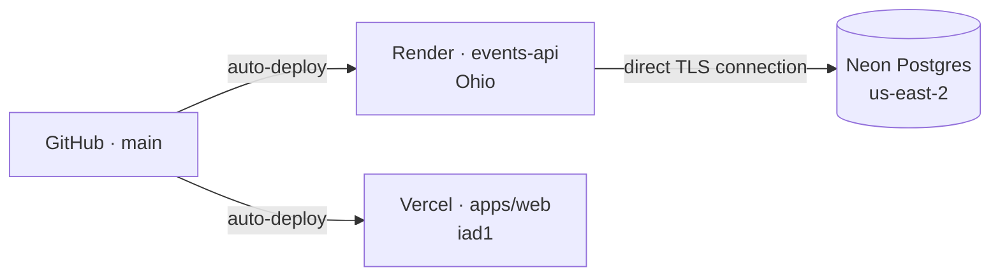

# Gather: Events & RSVP platform

A full-stack events module built with **NestJS + PostgreSQL** (API) and **Next.js** (web).
Hosts create events and people RSVP in one tap. When an event is full, new RSVPs join a waitlist, and the next person in line is promoted automatically when someone cancels.
The RSVP path never overbooks, even when many people join at the same moment.

| | Link |
|---|---|
| 🌐 **Live web app** | **https://rescue-rituals.vercel.app** |
| ⚙️ **API base URL** | `https://events-api-43jh.onrender.com/api/v1` |
| 📘 **Swagger docs** | **https://events-api-43jh.onrender.com/docs** |
| 🧾 **OpenAPI JSON** | https://events-api-43jh.onrender.com/docs-json |
| 📮 **Postman collection** | [`docs/events-api.postman_collection.json`](docs/events-api.postman_collection.json) (live URL preset) |
| 🎥 **Loom walkthrough** | `<add link>` |

> **Demo logins** (password `Password123!`): `demo@events.dev` hosts the demo events · `guest@events.dev` for RSVPs.
> The API runs on Render's free tier. If it has been idle, the first request can take about 30 seconds while it wakes up.

---

## Contents

1. [Quick start for reviewers](#1-quick-start-for-reviewers)
2. [Features](#2-features)
3. [Tech stack](#3-tech-stack)
4. [Architecture](#4-architecture)
5. [Data model](#5-data-model)
6. [RSVPs under a spike: the core design](#6-rsvps-under-a-spike-the-core-design)
7. [API reference](#7-api-reference)
8. [Authentication & security](#8-authentication--security)
9. [Frontend](#9-frontend)
10. [Decisions & assumptions](#10-decisions--assumptions)
11. [Testing](#11-testing)
12. [Run locally](#12-run-locally)
13. [Deployment & environment variables](#13-deployment--environment-variables)
14. [Project structure](#14-project-structure)
15. [What I'd build next](#15-what-id-build-next)

---

## 1. Quick start for reviewers

**In the web app (about 2 minutes)**
1. Open **https://rescue-rituals.vercel.app** and log in as `guest@events.dev` / `Password123!`.
2. Open **Postgres Performance Night** (one seat left) and RSVP. You take the last seat and the meter shows *Full*.
3. Open **Founders & Builders Breakfast** (already full) and click *Join waitlist*. You're placed on the waitlist.
4. Cancel your RSVP on the first event. Your seat goes to the next person on its waitlist automatically.
5. Click *Host an event* to create your own. Log in as `demo@events.dev` to try editing or cancelling an event as its host.

**In Swagger (about 1 minute)**
1. Open **/docs** → `POST /auth/login` → *Try it out* with the demo credentials above.
2. Copy `accessToken` → click **Authorize** → paste it.
3. Call `GET /events`, then `POST /events/{id}/rsvp`, then `GET /events/{id}/attendees`.

**With curl**
```bash
API=https://events-api-43jh.onrender.com/api/v1
TOKEN=$(curl -s -X POST $API/auth/login -H 'Content-Type: application/json' \
  -d '{"email":"guest@events.dev","password":"Password123!"}' | jq -r .accessToken)
curl -s "$API/events?limit=5" | jq '.items[] | {title, goingCount, seatsLeft}'
curl -s -X POST "$API/events/<eventId>/rsvp" -H "Authorization: Bearer $TOKEN"
```

---

## 2. Features

**Required scope**
- ✅ **Events CRUD:** create, list (search, date range, cursor pagination), get, update, cancel (soft delete)
- ✅ **RSVP / join with attendee tracking:** join, leave, "who's going" list, live seat count
- ✅ **JWT auth gating create and edit:** only signed-in users can create events, and only the **host** can edit or cancel one
- ✅ **Data model and API docs:** ER diagram (below), Swagger at `/docs`, Postman collection
- ✅ **Deployed:** API on Render, Postgres on Neon, web on Vercel

**Beyond scope**
- ⭐ **Full-stack Next.js app** consuming the API
- ⭐ **Waitlist with automatic promotion** when someone cancels
- ⭐ **Concurrency-safe RSVPs:** proven by a test (50 simultaneous RSVPs for 10 seats → exactly 10 in) and verified on the live deployment
- ⭐ **Idempotent RSVP:** double-taps and retries never double-book
- ⭐ **Optimistic locking** on event edits (409 instead of silently overwriting someone else's change)
- ⭐ **Draft events** visible only to their host
- ⭐ **Refresh-token rotation with reuse detection**
- ⭐ **Per-user rate limiting**, one consistent error format, health checks, demo data seeded on each deploy

---

## 3. Tech stack

| Layer | Choice | Why |
|---|---|---|
| API | **NestJS 11**, TypeScript (strict) | Modules, guards and pipes map cleanly onto this domain |
| Database | **PostgreSQL 16** on **Neon** | Constraints, row locks, partial indexes; managed and separate from the API |
| ORM | **Prisma 6**, plus raw SQL on the RSVP path | Type-safe and fast to build with; raw SQL where atomicity matters |
| Auth | `@nestjs/jwt`, Passport, **argon2id** | Stateless access tokens, current password-hashing recommendation |
| Validation | `class-validator` DTOs, global `ValidationPipe` | Whitelisting blocks mass assignment |
| Docs | `@nestjs/swagger` (generated from the DTOs) | Docs can't drift from the code |
| Web | **Next.js 16** (App Router), React 19, Tailwind CSS v4 | Server Components, Server Actions, `useOptimistic` |
| API client | `openapi-typescript` + `openapi-fetch` | Web types are generated from the API's OpenAPI spec |
| Hosting | Render (API) · Neon (DB) · Vercel (web), all in **US East** | A few milliseconds per hop, close to a US-based team |

---

## 4. Architecture



- **Monorepo:** `apps/api` and `apps/web`, each deployed from its own root directory.
- **Backend-for-frontend (BFF):** the browser never holds a token. Next.js Server Actions call the API and keep the JWTs in `httpOnly` cookies. `proxy.ts` silently refreshes expired access tokens and protects private routes.
- **One contract:** `apps/api/openapi.json` generates the web app's TypeScript types (`npm run gen:api`). If the API changes shape, the web build fails.
- **Modular monolith:** Nest modules (`auth`, `users`, `events`, `rsvps`, `health`) have clear boundaries without the operational cost of microservices. The API is stateless, so it scales horizontally.

---

## 5. Data model



**The database enforces the rules** ([migration SQL](apps/api/prisma/migrations/0001_init/migration.sql)):

| Constraint / index | Why |
|---|---|
| `UNIQUE (event_id, user_id)` on `rsvps` | A user can hold only one RSVP per event, even under double-taps and retries |
| `CHECK (going_count <= capacity)` | Postgres itself refuses to overbook, even if the application has a bug |
| `CHECK (ends_at > starts_at)`, `CHECK (capacity > 0)` | Invalid data can't be stored |
| Partial index `(starts_at, id) WHERE status='published' AND deleted_at IS NULL` | The busiest query (upcoming events) is a small index range scan, and it matches the keyset pagination order |
| `(event_id, status, updated_at)` on `rsvps` | Attendee lists and oldest-first waitlist promotion |
| `(user_id, status)` on `rsvps` | "My RSVPs" |

**Why a denormalised `going_count`?** Event lists are read far more often than RSVPs are written. A counter that's updated in the same transaction as the RSVP row is O(1) to read, instead of a `COUNT(*)` for every card on every page load. The CHECK constraint keeps the counter honest.

---

## 6. RSVPs under a spike: the core design

```sql
-- inside one transaction
INSERT INTO rsvps (event_id, user_id, status) VALUES ($1, $2, 'waitlisted')
ON CONFLICT (event_id, user_id) DO UPDATE SET event_id = EXCLUDED.event_id;  -- idempotent

UPDATE events SET going_count = going_count + 1                                -- claim a seat
 WHERE id = $1 AND status = 'published' AND starts_at > now()
   AND (capacity IS NULL OR going_count < capacity);
-- 1 row updated → 'going'   ·   0 rows updated → stays 'waitlisted'
```

The seat check and the increment are **one atomic statement**. Postgres row-locks the event for the `UPDATE`, so simultaneous requests queue on that row, and each one re-checks `going_count < capacity` against the latest committed value. There's no read-then-write race, no application-level lock and no `SERIALIZABLE` retries. Cancelling decrements the count and promotes the oldest waitlisted RSVP (`FOR UPDATE SKIP LOCKED`) in the same transaction. Code: [`rsvps.service.ts`](apps/api/src/rsvps/rsvps.service.ts).

**Proof**
- e2e test: 50 simultaneous RSVPs for 10 seats → exactly **10 going, 40 waitlisted**, and the counter matches the rows.
- Live deployment: 12 simultaneous RSVPs for 3 seats → exactly **3 going, 9 waitlisted**.

**Scaling further**

| Load | Approach |
|---|---|
| Up to about 1k RSVPs/s on one event | This design, plus connection pooling (PgBouncer or Neon's pooler once there are several API instances) |
| A viral event, 10k+/s | Admit people through an atomic Redis `DECR` on a seat counter (Lua script), queue the winners (SQS/BullMQ), and have workers write to Postgres in batches. The API returns `202` with a status to poll. Postgres stays the source of truth, with a reconcile job |
| A flood of reads on the event page | Stateless API instances scale horizontally; cache event reads for about 5 s at the CDN or in Redis |
| Abuse and bots | Per-user rate limits, idempotent RSVPs, CAPTCHA only on hot events |

---

## 7. API reference

Base URL: `https://events-api-43jh.onrender.com/api/v1` · interactive docs: **[/docs](https://events-api-43jh.onrender.com/docs)**

| Method | Path | Auth | Description |
|---|---|---|---|
| POST | `/auth/register` | – | Create an account → `{ accessToken, refreshToken, expiresIn, user }` |
| POST | `/auth/login` | – | Log in → same shape |
| POST | `/auth/refresh` | – | Rotate tokens; reusing an old refresh token revokes the session |
| POST | `/auth/logout` | JWT | Revoke the refresh token |
| GET | `/events` | – | Upcoming published events · `?q&from&to&creatorId&limit&cursor` |
| GET | `/events/:id` | optional | Event details; adds `myRsvpStatus` when signed in |
| POST | `/events` | JWT | Create an event (you become the host) |
| PATCH | `/events/:id` | JWT · host | Update; send `version` for optimistic locking |
| DELETE | `/events/:id` | JWT · host | Cancel the event (soft delete) |
| POST | `/events/:id/rsvp` | JWT | RSVP → `going` or `waitlisted` (idempotent) |
| DELETE | `/events/:id/rsvp` | JWT | Cancel your RSVP; promotes the next person on the waitlist |
| GET | `/events/:id/attendees` | – | People going, in the order they got a seat (paginated) |
| GET | `/users/me` | JWT | Profile with hosting and going counts |
| GET | `/users/me/events` | JWT | Events you host (drafts and past included) |
| GET | `/users/me/rsvps` | JWT | Events you're going to or waitlisted for |
| GET | `/health` | – | Liveness plus a database check |

**Example: RSVP to a full event**
```http
POST /api/v1/events/5b1e…/rsvp
Authorization: Bearer <token>

200 OK
{ "eventId": "5b1e…", "status": "waitlisted", "goingCount": 3, "seatsLeft": 0 }
```

**Errors: one shape everywhere**
```json
{ "statusCode": 403, "error": "FORBIDDEN", "message": "Only the host can change this event.",
  "path": "/api/v1/events/5b1e…", "timestamp": "2026-09-25T10:00:00.000Z" }
```
`400` validation · `401` missing or invalid token · `403` not the host · `404` not found · `409` conflict (stale version, event started or cancelled, capacity below the number going) · `429` rate limited.

---

## 8. Authentication & security

- **Passwords** are hashed with **argon2id**. Login errors are generic, so they don't reveal which emails have accounts.
- **Access token** (15 min) plus **refresh token** (7 days). Refresh tokens are **rotated** on every use, and only their SHA-256 hash is stored. Reusing an old refresh token (a sign of theft) revokes the session.
- **Authorization:** for edits, the ownership check is part of the `UPDATE … WHERE creator_id = $user` statement itself, so there's no gap between checking and writing. Drafts return `404` to non-hosts, so their existence isn't leaked.
- **Input:** a global `ValidationPipe` with `whitelist` and `forbidNonWhitelisted` rejects unknown fields (mass assignment). All SQL is parameterised, including the raw queries.
- **Transport and headers:** `helmet`, a CORS allowlist, and `trust proxy` for real client IPs behind Render.
- **Rate limiting** is keyed by **user** when a token is present and by IP otherwise. Every browser request reaches the API from Vercel's server IPs, so limiting by IP alone would throttle all users together.
- **Web sessions** live in `httpOnly`, `Secure`, `SameSite=Lax` cookies. Tokens never reach browser JavaScript, so an XSS bug can't steal them.
- **Secrets** live only in the Render and Vercel dashboards and are never committed; `.env` files are git-ignored.

---

## 9. Frontend

Next.js 16 (App Router), deployed on Vercel.

| Route | What it does |
|---|---|
| `/` | Upcoming events: search, cards with a seats-left meter, "Load more" (cursor) |
| `/events/[id]` | Details, host, attendee list, RSVP / waitlist / cancel, host tools |
| `/events/new` · `/events/[id]/edit` | Create and edit forms (the host picks times in local time; the API stores UTC) |
| `/me` | Tabs: *Going & waitlisted* / *Hosting* |
| `/login` · `/register` | Auth, with a redirect back to where the user started |

- **Optimistic RSVP** (`useOptimistic`): the button updates instantly, then reconciles with the server. If the last seat went to someone else a moment earlier, it shows "waitlisted" and explains why.
- **Server Components** for reads (fast first paint, no API token in the browser), **Server Actions** for writes.
- Every state is designed: loading skeletons, empty states, full, past, error. The layout is mobile-first, with dark mode and accessible markup (labels, focus states, `aria-live` RSVP feedback).

---

## 10. Decisions & assumptions

The brief was deliberately open, so these are the calls I made:

- **Capacity is optional** (`null` = unlimited). When it's set, extra RSVPs **join a waitlist** instead of being rejected, which keeps demand visible to the host.
- **You can't RSVP to past, cancelled or draft events.** The host isn't counted as an attendee automatically.
- **Soft delete** (status `cancelled` plus `deleted_at`) keeps the attendee history, so attendees can be notified later.
- **UUID primary keys:** safe to expose, and they can't be enumerated.
- **Times are stored as `timestamptz` in UTC** and rendered in each viewer's timezone (the team spans IST and ET).
- **Keyset pagination** instead of OFFSET: stable while events are being inserted, and fast on deep pages.
- **Stateless access tokens** (no database hit per request), with short lifetimes and server-side refresh rotation.
- **Prisma for productivity, raw SQL on the hot path**, where atomicity matters more than ORM convenience.
- **The database is separate from the API** (Neon): the API stays stateless and can be scaled or moved independently.

---

## 11. Testing

The e2e suite runs against a **real Postgres**, because constraints and race conditions are exactly what mocks would hide.

```bash
cd apps/api && npm run test:e2e
```

| Test | What it proves |
|---|---|
| Auth | Register, duplicate email → 409, wrong password → 401, refresh rotation, reuse → revoked |
| Mass assignment | Unknown fields → 400 |
| Events | Auth required, time validation, search, cursor pagination with no duplicates |
| Ownership | Non-host edit or delete → 403; stale `version` → 409 |
| Drafts | Hidden from everyone but the host |
| RSVP | Idempotent; `myRsvpStatus`; attendee count |
| **Concurrency** | **50 simultaneous RSVPs for 10 seats → exactly 10 going, 40 waitlisted** |
| Waitlist | Cancelling promotes the oldest waitlisted person |
| Capacity | Can't be lowered below the number already going |

---

## 12. Run locally

Requires **Node 22+** (24 recommended) and **Docker**.

```bash
# 1. Database (Postgres 16 on :5433; creates `events` and `events_test`)
docker compose up -d

# 2. API → http://localhost:3001/docs
cd apps/api
cp .env.example .env
npm install
npx prisma migrate deploy && npm run build && npm run db:seed
npm run start:dev

# 3. Web → http://localhost:3000
cd ../web
echo "API_URL=http://localhost:3001" > .env.local
npm install
npm run dev
```

After changing API DTOs, regenerate the web types: `cd apps/api && npm run openapi`, then `cd apps/web && npm run gen:api`.

---

## 13. Deployment & environment variables



**Database: Neon.** Create a project in **AWS US East 2** and copy the **direct** connection string (connection pooling off). Prisma migrations take an advisory lock that a pooler can't hold.

**API: Render** ([`render.yaml`](render.yaml) Blueprint). Go to **New → Blueprint**, pick the repo, paste the Neon string as `DATABASE_URL`, and click **Apply**.
Each deploy runs `prisma migrate deploy`, then the idempotent seed, then starts the server. The health check is `/api/v1/health`.

**Web: Vercel.** Import the repo, set the root directory to `apps/web`, set `API_URL`, and deploy.

| Service | Variable | Value |
|---|---|---|
| Render | `DATABASE_URL` | Neon direct connection string (secret) |
| Render | `JWT_ACCESS_SECRET`, `JWT_REFRESH_SECRET` | Generated by the Blueprint |
| Render | `CORS_ORIGINS` | `https://rescue-rituals.vercel.app` |
| Render | `NODE_VERSION` | `24` |
| Vercel | `API_URL` | `https://events-api-43jh.onrender.com` (no trailing slash) |
| GitHub (optional) | repo variable `API_URL` | Enables the [keep-warm ping](.github/workflows/keep-warm.yml) so the free API doesn't sleep |

---

## 14. Project structure

```
apps/
  api/                       NestJS API
    prisma/                  schema + versioned SQL migrations
    src/
      auth/                  register, login, refresh rotation, JWT strategy and guards
      events/                CRUD, host-only edits, optimistic locking, keyset pagination
      rsvps/                 concurrency-safe RSVP, waitlist, attendees
      users/                 /users/me, my events, my RSVPs
      common/                error filter, per-user throttler, pagination, decorators
      health/                database health check
      seed.ts                idempotent demo data (runs on every deploy)
    test/                    e2e suite against a real Postgres
  web/                       Next.js 16 app
    src/app/                 pages + Server Actions (BFF)
    src/components/          RSVP button, event form, cards, capacity meter, …
    src/lib/                 typed API client (generated from OpenAPI), session helpers
    src/proxy.ts             silent token refresh + route protection
docs/                        Postman collection
render.yaml                  Render Blueprint
docker-compose.yml           local Postgres
```

---

## 15. What I'd build next

- **Notifications:** RSVP confirmations, "you're off the waitlist", and 1-hour reminders, using a queue and workers (BullMQ or SQS) with idempotent sends.
- **Roles and co-hosts:** an `event_hosts` join table and a policy layer on top of the ownership check.
- **Event images:** S3 presigned uploads, served through a CDN.
- **Location search:** PostGIS `geography` column, a GIST index, `ST_DWithin` queries.
- **Observability:** OpenTelemetry traces, structured logs with request IDs, RED metrics and alerts.
- **Hot-event mode:** the Redis admission gate and queue described in [section 6](#6-rsvps-under-a-spike-the-core-design), switched on per event.
