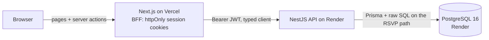
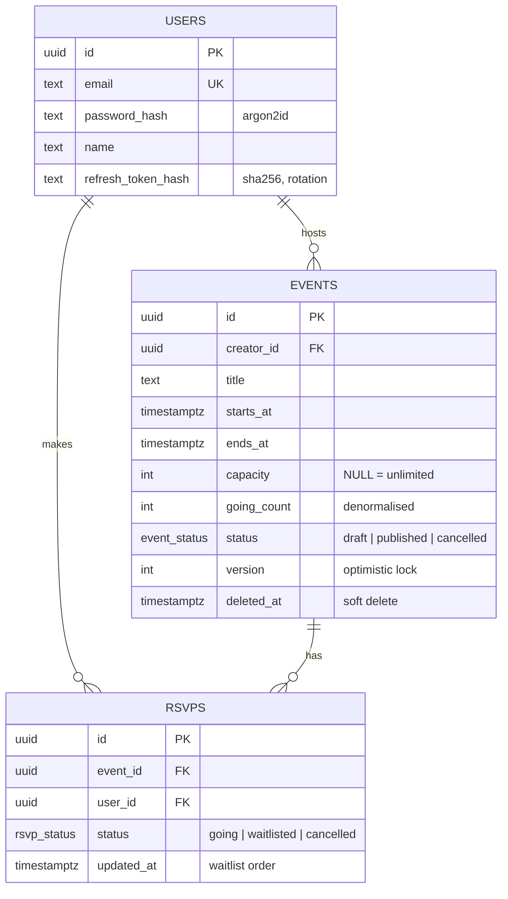

# Gather: Events & RSVP platform

A full-stack events module: **NestJS + PostgreSQL API** with a **Next.js** frontend.
Host events, RSVP in one tap, and join a waitlist when an event is full. The waitlist is promoted automatically, and the RSVP path stays correct when many people join at the same moment.

| | URL |
|---|---|
| **Web app** (Vercel) | `https://<your-app>.vercel.app` |
| **API base URL** (Render) | `https://<your-api>.onrender.com/api/v1` |
| **Swagger docs** | `https://<your-api>.onrender.com/docs` |
| **OpenAPI JSON** (import into Postman) | `https://<your-api>.onrender.com/docs-json` |
| Loom walkthrough | `<link>` |

**Demo logins** (password `Password123!`): `demo@events.dev` hosts the seeded events; use `guest@events.dev` to RSVP.
The seed includes an event with **one seat left** and one that's **full**, so you can try the waitlist straight away.

---

## Architecture



- **Monorepo:** `apps/api` (NestJS) and `apps/web` (Next.js). Each deploys from its own root directory.
- **Backend-for-frontend:** the browser never sees a token. Next.js server actions call the API and keep JWTs in `httpOnly`, `SameSite=Lax` cookies. `proxy.ts` refreshes expired access tokens silently and guards private routes.
- **One contract:** the API's OpenAPI spec (`apps/api/openapi.json`) generates the web app's TypeScript types (`npm run gen:api`). If the API changes shape, the web build fails.
- **Modular monolith:** Nest modules (`auth`, `users`, `events`, `rsvps`, `health`) have clear boundaries without the cost of running microservices.

## Data model



**The database enforces the rules** ([migration](apps/api/prisma/migrations/0001_init/migration.sql)):

| Constraint / index | Why |
|---|---|
| `UNIQUE (event_id, user_id)` on rsvps | A user can't hold two RSVPs, even if they double-tap or the client retries |
| `CHECK (going_count <= capacity)` | Postgres itself refuses overbooking, even if the application has a bug |
| `CHECK (ends_at > starts_at)`, `capacity > 0` | Invalid data can't be stored |
| Partial index `(starts_at, id) WHERE published AND not deleted` | The busiest query (upcoming events) is a small index range scan |
| `(event_id, status, updated_at)` on rsvps | Attendee lists, and oldest-first waitlist promotion |

## RSVPs under a spike (the core design)

```sql
-- inside one transaction
INSERT INTO rsvps (...) VALUES (...) ON CONFLICT (event_id, user_id) DO UPDATE ...;  -- idempotent
UPDATE events SET going_count = going_count + 1
 WHERE id = $1 AND status = 'published' AND starts_at > now()
   AND (capacity IS NULL OR going_count < capacity);                             -- claim a seat
-- 1 row updated → 'going'   ·   0 rows → 'waitlisted'
```

The seat check and the increment are **one atomic statement**. Postgres row-locks the event for the `UPDATE`, so concurrent requests queue on that row and each one re-checks `going_count < capacity` against the latest committed value. There's no read-then-write race, no application lock and no `SERIALIZABLE` retries. Cancelling decrements the count and promotes the oldest waitlisted RSVP (`FOR UPDATE SKIP LOCKED`), all in the same transaction. See [rsvps.service.ts](apps/api/src/rsvps/rsvps.service.ts).

**Proven by a test:** 50 simultaneous RSVPs for 10 seats → exactly 10 `going`, 40 `waitlisted`, and the counter matches the rows ([e2e test](apps/api/test/events.e2e-spec.ts)).

**Scaling further:**

| Load | Approach |
|---|---|
| Up to ~1k RSVP/s on one event | This design, plus a connection pool (PgBouncer once there are several API instances) |
| A viral event, 10k+/s | Redis `DECR` seat counter as the admission gate (Lua, atomic), then a queue (SQS/BullMQ), then batched Postgres writes by workers. The API returns `202` with a status to poll. Postgres stays the source of truth |
| A flood of reads on the event page | Stateless API instances scale horizontally; cache the event read for ~5s at the CDN or in Redis |
| Abuse | Per-user rate limits (`UserThrottlerGuard`), idempotent RSVP, CAPTCHA only on hot events |

## API

All routes are under `/api/v1`. Full reference: **`/docs`** (Swagger, with an *Authorize* button).

| Method | Path | Auth | Notes |
|---|---|---|---|
| POST | `/auth/register` · `/auth/login` | – | Returns `{ accessToken (15 min), refreshToken (7 days), user }` |
| POST | `/auth/refresh` | – | Rotates the refresh token. Reusing an old one revokes the session |
| POST | `/auth/logout` | JWT | Revokes the refresh token |
| GET | `/events` | – | Upcoming published events. `?q&from&to&creatorId&limit&cursor` (keyset pagination) |
| GET | `/events/:id` | optional | Adds `myRsvpStatus` when signed in. Drafts are visible only to the host |
| POST | `/events` | JWT | The creator becomes the host |
| PATCH | `/events/:id` | JWT, host | Send `version` for optimistic locking (409 if stale). Capacity can't go below the number going |
| DELETE | `/events/:id` | JWT, host | Soft delete (sets status to `cancelled`) |
| POST | `/events/:id/rsvp` | JWT | Idempotent. Returns `going` or `waitlisted` |
| DELETE | `/events/:id/rsvp` | JWT | Cancels your RSVP and promotes the next person on the waitlist |
| GET | `/events/:id/attendees` | – | Paginated, in the order people got their seat |
| GET | `/users/me` · `/users/me/events` · `/users/me/rsvps` | JWT | Profile, events you host, your RSVPs |
| GET | `/health` | – | Checks the database; used by Render's health check |

Every error has the same shape: `{ statusCode, error, message, path, timestamp }`.
Status codes: `400` validation · `401` no/bad token · `403` not the host · `404` not found · `409` conflict · `429` rate limited.

## Decisions & assumptions

- **Capacity is optional.** `null` means unlimited. When a capacity is set, extra RSVPs join a **waitlist** instead of being rejected, which keeps demand visible to the host.
- **You can't RSVP to past, cancelled or draft events.** The host isn't counted as an attendee automatically.
- **Soft delete** keeps the attendee history, so attendees can be notified later.
- **UUID keys:** IDs can't be guessed or enumerated, and are safe to show to clients.
- **Times are stored as `timestamptz` in UTC** and rendered in the viewer's timezone (the team spans IST and ET).
- **Keyset (cursor) pagination** instead of OFFSET: stable while new events are inserted, and fast on deep pages.
- **Stateless JWT access tokens** (no database hit per request) with short lifetimes, plus server-side refresh-token rotation and reuse detection.
- **Rate limits are keyed by user, not IP**, because the web app calls the API from its server (the BFF), so all browser users share Vercel's IP.
- **Prisma for productivity, raw SQL on the hot path**, where atomicity matters more than ORM convenience.
- **Out of scope (next steps):** roles and co-hosts, notifications and reminders (queue + worker), image uploads (S3 presigned URLs), recurring events, observability (OpenTelemetry).

## Run locally

Requires Node 20+ and Docker.

```bash
docker compose up -d                      # Postgres 16 on :5433 (creates events + events_test)

cd apps/api
cp .env.example .env
npm install
npx prisma migrate deploy && npm run build && npm run db:seed
npm run start:dev                         # http://localhost:3001/docs
npm run test:e2e                          # e2e suite incl. the 50-concurrent-RSVP test

cd ../web
echo "API_URL=http://localhost:3001" > .env.local
npm install
npm run dev                               # http://localhost:3000
```

After changing API DTOs: `cd apps/api && npm run openapi`, then `cd apps/web && npm run gen:api`.

## Deploy

**API and database: Render** (a [Blueprint](render.yaml) creates both)
1. Push this repo to GitHub.
2. Render dashboard → **New → Blueprint** → select the repo → **Apply**. This creates `events-db` (Postgres 16) and `events-api`, and generates the JWT secrets.
3. On every deploy the API runs `prisma migrate deploy`, then the idempotent seed, then starts. The health check is `/api/v1/health`.

**Web: Vercel**
1. Vercel → **Add New → Project** → import the repo → set **Root Directory** to `apps/web`.
2. Add the environment variable `API_URL=https://<your-api>.onrender.com` → **Deploy**.
3. Back in Render, set `CORS_ORIGINS=https://<your-app>.vercel.app` on `events-api`.

**Keep it warm:** Render's free tier sleeps after 15 idle minutes. Set the GitHub repo variable `API_URL` and the [keep-warm workflow](.github/workflows/keep-warm.yml) pings `/health` every 10 minutes.

CI ([ci.yml](.github/workflows/ci.yml)) runs the API e2e suite against a real Postgres service, and builds the web app, on every push.
